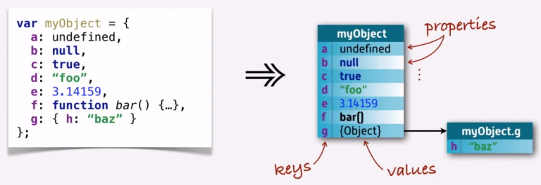
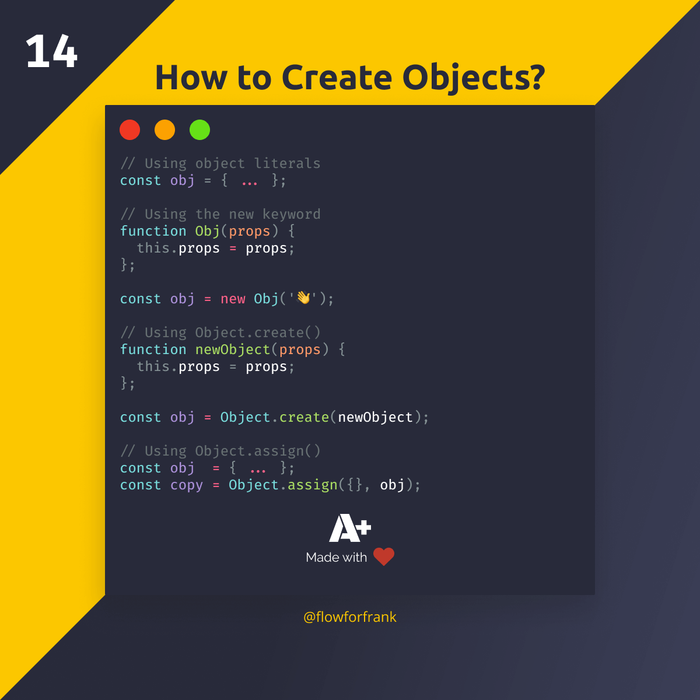

## Que es un Objeto en JavaScript
JavaScript está diseñado en un paradigma simple basado en objetos. Un objeto es una colección de propiedades y una propiedad es una asociación entre un nombre (o clave ) y un valor. El valor de una propiedad puede ser una función, en cuyo caso la propiedad se conoce como método .

Los objetos en Javascript permiten almacenar una gran cantidad de datos.

Los objetos pueden almacenar practiacmente cualquier tipo de dato, incluso pueden ser string almacenando otro string

 // este caso es muy practico para almacenar infomarcion del tipo texto

Esta es la manera mas sencilla de crear objetos, tambien existen funciones/metodos propios de JS que permiten crear OBJ

 //old mode, forma antigua de crear objetos

 //Ejemplos

## Como acceder a su clave valor en los obj

*Dot Notation
Notacion de puntos, esta es relativamente la forma mas sencilla pero no dinamica
 

*bracket notation
Esta manera simula ser el llamado como si fuera una matriz, su ventaja es que es totalmente dinamica; se pueden pasar como parametros los valores

 