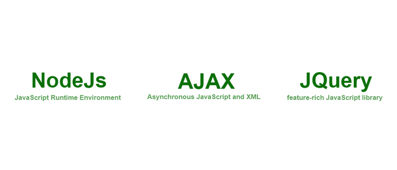
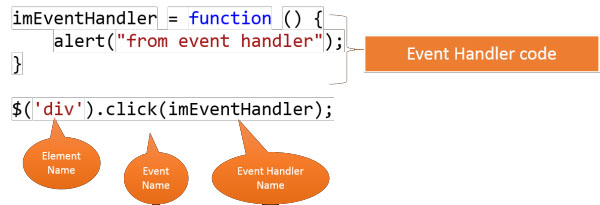

## JavaScript
JavaScript (JS) es un lenguaje de programación ligero, interpretado, o compilado justo-a-tiempo (just-in-time) con funciones de primera clase. Si bien es más conocido como un lenguaje de scripting (secuencias de comandos) para páginas web, y es usado en muchos entornos fuera del navegador, tal como Node.js, Apache CouchDB y Adobe Acrobat JavaScript es un lenguaje de programación basada en prototipos, multiparadigma, de un solo hilo, dinámico, con soporte para programación orientada a objetos, imperativa y declarativa (por ejemplo programación funcional). 

## ¿Cómo empieza la historia de JavaScript?
JavaScript nace a partir de un navegador que actualmente no existe: NetScape. En 1995, Netscape se dio cuenta de que, cuando tenía algún documento HTML, no podía interactuar con lo que hacía el usuario. Es decir, lo único que podía hacer el navegador era esperar a recibir unos datos y luego enviarlos, a modo de formulario. Además, podía darle ciertos aspectos de diseño, como el alto y ancho, pero con muy poca versatilidad.

Entonces, Brendan Eich creó JavaScript para NetScape. Este lenguaje de programación le da muchas más posibilidades a los navegadores. Con JavaScript podemos, por ejemplo, crear controles en la búsqueda de un contenido para que solo devuelva resultados con contenido, no textos vacíos.

El siguiente momento importante en la historia de JavaScript es la creación del elemento XML HttpRequest por parte de Microsoft en 1998. Este elemento viene a ser el padre de AJAX y nos permite cargar contenido o interactuar con el backend sin tener que volver a cargar la totalidad de la página web.

A lo largo de los años, se continuó hablando de JavaScript y, en el 2000, Douglas Crockford inventó el documento JSON, una forma de estandarizar objetos en JavaScript. En 2004, Gmail empezó a utilizar JavaScript e incorporó AJAX masivamente para hacer sus procesos más eficaces.

Llegados a este punto, JavaScript era tan útil que, en 2006, John Resig creó la librería JQuery, que nos permite reducir la complejidad de la sintaxis de JavaScript.

## Lo navegadores como participantes importantes
Los navegadores también pueden ser una fuente de cambio en el desarrollo web. En 2009, no solo nace Google Chrome, sino que también nace el motor de JavaScript V8, que actúa como su intérprete. En el mismo año, Ryan Dahl se dio cuenta de que podía aislar el motor V8 de Chrome y lo usó para crear NodeJS, haciendo que la tecnología se separase del navegador. Con esto, volvió a JavaScript un lenguaje de programación crossplatform. Esto quiere decir que ahora se puede usar en un sistema operativo Windows, Unix, Linux y demás.

En los años recientes, hemos visto que JavaScript sigue creciendo. En 2012, Windows 8 incorporó JavaScript como su lenguaje nativo y, en 2014, se estableció el estándar de este lenguaje de programación, conocido como ES6 o ES2015.

## Variable en JavaScript
Las variables son un concepto fundamental en cualquier lenguaje de programación. En JavaScript, puedes declarar variables usando las palabras clave var, const o let.

Su hizo principal es alamacenar datos que en algun futuro podramos utilizar, ya sean temporales u permanentes como ser el caso de un login exitoso

## Tipado de JavaScript
Por su naturaleza JavaScript no es un lenguaje fuertemente tipado, esto quiere decir que ciertos datos pueden sobreescribirse, si poseo una variable que contenga numeros puedo cambiar el contenido u el tipo del contenido.
Incluso puedo crear variables sin asignar ningun valor u contenido

## Scope u Alcance
El alcance en JavaScript se refiere al contexto actual del código, que determina la accesibilidad de las variables a JavaScript. Los dos tipos de alcance son locales y globales: Las variables globales son aquellas declaradas fuera de un bloque. Las variables locales son aquellas declaradas dentro de un bloque.

